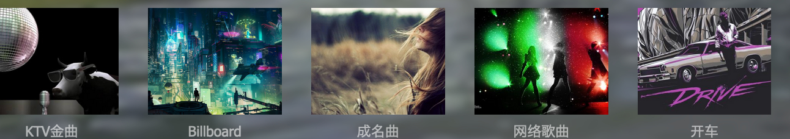
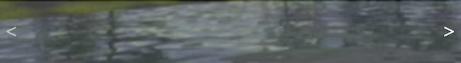

### 项目名称
> Fun Fun Radio

### 基本介绍
- 一个网页音乐盒子

主要功能：
1. 专辑内(`同一个主题`)中音乐的自动播放，播放，暂停，下一曲，以及下一曲自动播放

2. 音乐播放进度条与播放时间的显示

3. 音乐专辑的轮播切换

4. 歌词的显示与动态效果

5. 歌曲作者与专辑主题以及主题背景的同步显示

### 技术细节
- @media媒体查询
> 页面布局要求是垂直方向100%撑满， 水平宽度方向自适应。一开始尝试以 `px`、`rem`、`百分比`都不达到全局全局等比缩放的效果(`背景图片 icon 字体`)。后尝试在用`vh`做单位，几乎所有的单位都使用`vh`，最终达到的效果是所有元素在一定范围内都能等比缩放显示。

- EventCenter功能
> 消息中心连接 musicPage 的main与 footer两个部分，达到两部分之间功能的解耦。
点击`footer`部分触发`EventCenter.fire('someThing', data )`, `main`部分监听`foote`r触发的事件`EventCenter.on('someThing', function(e, data){...}) )`获得data 

```javascript
var EventCenter = {
  on: function(type, handler){
    $(document).on(type, handler)
  },
  fire: function(type, data){
    return $(document).trigger(type, data)
  }
}
```
- 专辑切换nextBtn按钮

`遇到的问题一：`点击右按钮，切换的专辑。当前视图显示的一排的第一个专辑背景图(`KTV金曲`)并不是完整显示的


解决方法： 
```javascript
// 每一个专辑的宽度(包括margin)
var itemWidth = _this.$box.find('li').outerWidth(true)

// 每次移动margin-left,都是一个 整数的专辑数* itemWidth
var rowCount = Math.floor(_this.$box.outerWidth(true)/itemWidth)
```

`遇到的问题二：`快速点击左右按钮就会出现，明明是最后一张专辑了，即使到了最后依然会有向左偏移或是向右移偏移(`出现空白部分`)


**解决方法**： 
判断给最后一版本显示的专辑数是否小于 `rowCount`，如小于则下一次就不执行点击右按钮任何操作

```javascript
var leftAlready = -Math.floor(parseInt(ulStyle.getPropertyValue('margin-left'))/itemWidth)

var notLeftCount = itemCount - leftAlready
_this.isScrollStart = false
if (notLeftCount < rowCount) {
_this.isScrollEnd = true
_this.$nextBtn.css('cursor', 'not-allowed')
} 
```
上面的操作会保证正常的点击右按钮，不会导致显示的不正常。但是快速依然
会出现图片中的问题(`左右按钮都会`)
需要在`Footer.init`设定一个属性`this.isAnimate = false`然后每次对`this.isAnimate`的值为`false`还是`true`做出判断

### 项目收获
- 对JQuery更熟练的运用

- 对CSS相关知识点 `flex` `@media` `布局` `box-shadow`有了进一步的了解

- 函数封装意识有加强

- 理解Jquery组件的基本开发与简单使用

- 掌握animate.css 动画库的简单使用

### 技术关键字
**JavaScript**、**Jquery**、**CSS3**、**animate.css**、**@media媒体查询**、**flex布局**